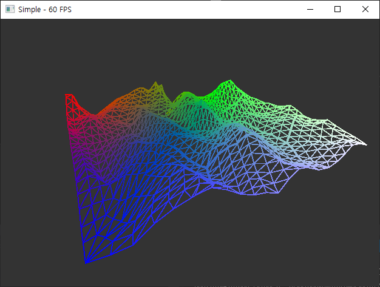
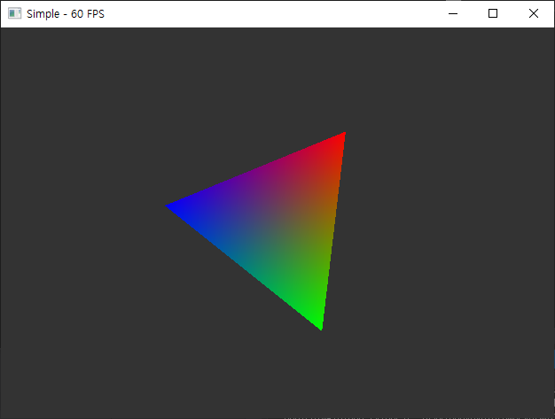

# DXGraphicsPlayground
This workspace contains subprojects for testing DirectX features.

## Requirements
* Windows 10 with DirectX 12 support
  * Feature Level 11.0 or later
* Visual Studio 2017 or later

## D3D11Simple

* Single window and tessellated heightmap wireframe drawing.

## D3D12Simple

* Single window and simple triangle drawing.

## D3D12TileDeferred

* Under construction
